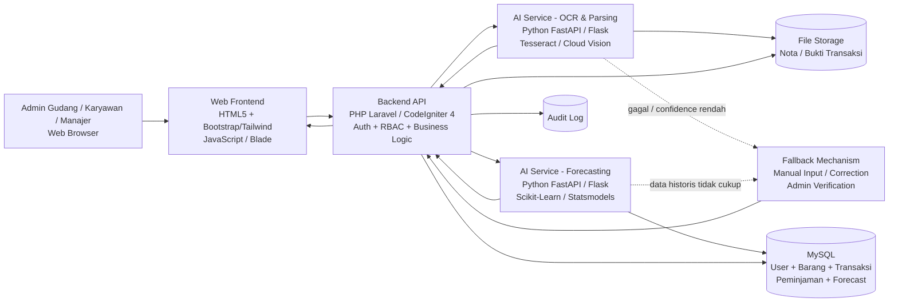
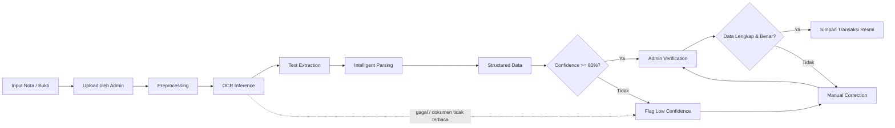
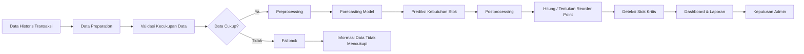
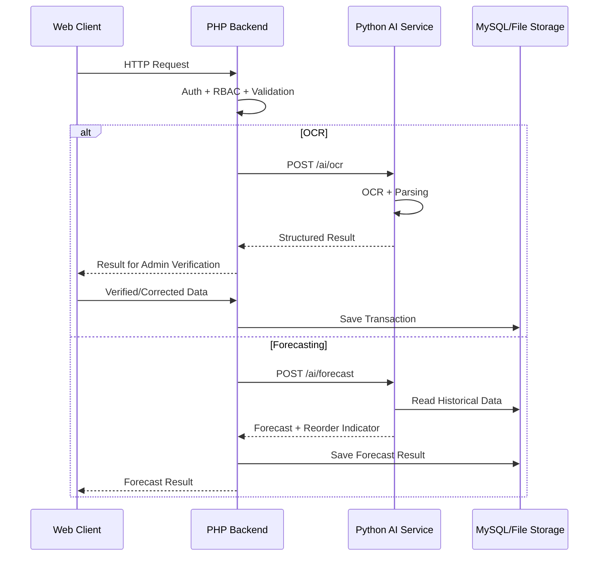
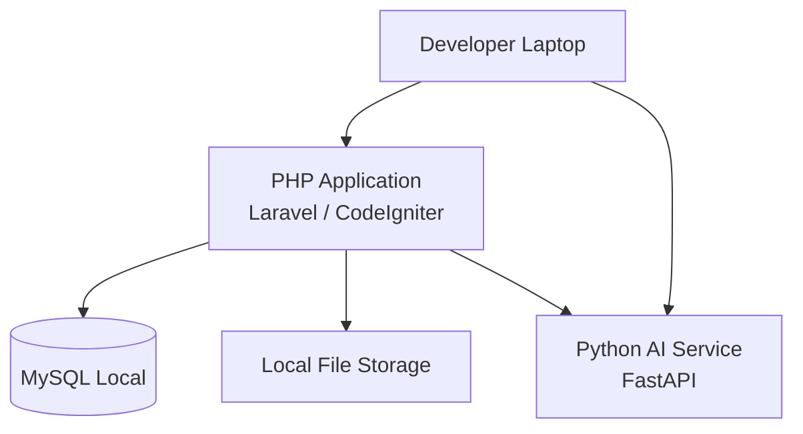
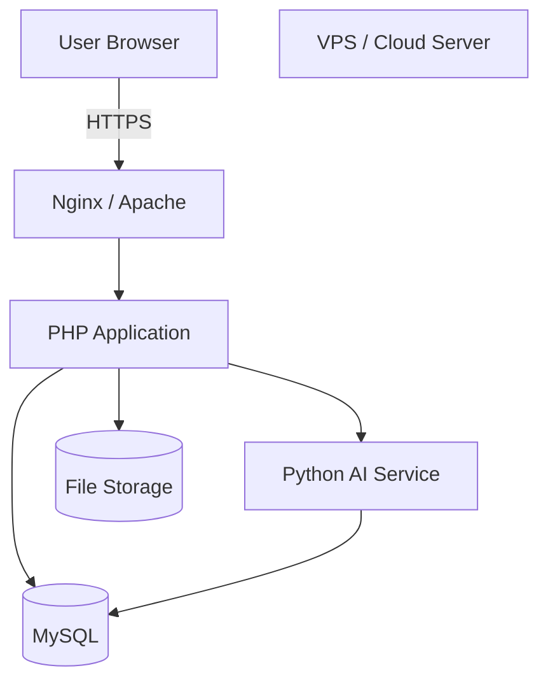

Berikut DRAF HLD yang disusun hanya berdasarkan PRD, SRS, dan User Stories yang kamu berikan. Detail yang belum ditentukan di acuan saya tandai sebagai **[ASUMSI-XX]** agar tidak dianggap sebagai requirement bisnis baru.

# HIGH-LEVEL DESIGN (HLD)

## Smart Inventory & Stock Demand Forecasting System

### 1. Diagram Arsitektur Sistem

Arsitektur yang direkomendasikan menggunakan **modular monolith pada backend PHP** dengan **AI Service terpisah menggunakan Python**. Pendekatan ini sesuai untuk MVP 3–4 bulan karena tetap sederhana untuk dikembangkan, tetapi modul AI dapat dipisahkan dari aplikasi utama.



### Prinsip Arsitektur

1. **Web Browser** menjadi antarmuka seluruh aktor.
2. **Backend PHP** menjadi pusat pengelolaan autentikasi, otorisasi, transaksi, inventori, dan komunikasi dengan AI.
3. **AI Service Python** menangani proses komputasi OCR, parsing dokumen, forecasting, dan deteksi stok kritis.
4. **MySQL** menyimpan data operasional dan hasil AI yang telah diverifikasi.
5. **File Storage** digunakan untuk menyimpan dokumen nota/bukti transaksi.
6. **Fallback Mechanism** memastikan proses bisnis tetap dapat berjalan ketika AI gagal atau hasil AI membutuhkan koreksi.
7. AI **tidak langsung menentukan transaksi resmi**. Hasil OCR wajib melalui verifikasi Admin Gudang sesuai BR-12 dan BR-13.

---

# 2. Deskripsi Komponen dan Decision Trade-Off

## 2.1 Komponen Utama

| Komponen               | Tanggung Jawab                                                                  | Rekomendasi Teknologi                         |
| ---------------------- | ------------------------------------------------------------------------------- | --------------------------------------------- |
| Web Client             | Menampilkan dashboard, formulir, transaksi, laporan, hasil AI                   | HTML5 + Bootstrap/Tailwind + JavaScript/Blade |
| Backend API            | Auth, RBAC, validasi bisnis, transaksi, inventori, komunikasi AI                | Laravel / CodeIgniter 4                       |
| AI OCR Service         | Membaca teks dari nota/bukti dan melakukan parsing informasi                    | Python + FastAPI + Tesseract                  |
| AI Forecasting Service | Mengolah data historis dan menghasilkan prediksi kebutuhan stok                 | Python + FastAPI + Scikit-Learn/Statsmodels   |
| Database               | Menyimpan data user, barang, stok, transaksi, peminjaman, dan hasil forecasting | MySQL                                         |
| File Storage           | Menyimpan dokumen nota/bukti transaksi                                          | Local/VPS Storage [ASUMSI-01]                 |
| Authentication         | Login dan pengelolaan sesi/token                                                | Session-based Auth atau JWT [ASUMSI-02]       |
| Audit Log              | Mencatat aktivitas transaksi dan perubahan stok                                 | MySQL [ASUMSI-03]                             |
| Fallback               | Menjaga proses tetap berjalan ketika AI gagal                                   | Manual Input + Admin Verification             |

---

## 2.2 Trade-off Keputusan AI

### OCR

| Parameter           | Self-Hosted / On-Server                           | Cloud API                                           |
| ------------------- | ------------------------------------------------- | --------------------------------------------------- |
| Akurasi             | Bergantung pada preprocessing dan engine          | Umumnya baik pada dokumen yang didukung             |
| Latensi             | Tidak bergantung internet eksternal               | Bergantung jaringan dan API                         |
| Biaya               | Biaya awal rendah, tetapi memakai resource server | Berpotensi berdasarkan jumlah penggunaan            |
| Privasi             | Data tetap berada pada server sendiri             | Dokumen dikirim ke layanan eksternal                |
| Effort Pengembangan | Perlu konfigurasi OCR dan preprocessing           | Integrasi API relatif lebih sederhana               |
| Ketergantungan      | Lebih mandiri                                     | Bergantung provider                                 |
| Cocok untuk MVP     | Ya                                                | Ya, tetapi perlu mempertimbangkan biaya dan privasi |

### Forecasting

| Parameter           | Self-Hosted Python                        | Cloud AI/API                           |
| ------------------- | ----------------------------------------- | -------------------------------------- |
| Akurasi             | Dapat dikontrol melalui model dan data    | Bergantung layanan/model provider      |
| Latensi             | Dapat diprediksi pada server sendiri      | Bergantung jaringan/API                |
| Biaya               | Relatif rendah setelah deployment         | Dapat bertambah berdasarkan penggunaan |
| Privasi             | Data historis tetap di lingkungan sendiri | Data dapat keluar ke layanan eksternal |
| Effort Pengembangan | Perlu membangun service dan model         | Integrasi API lebih sederhana          |
| Kontrol Model       | Tinggi                                    | Terbatas pada layanan provider         |
| Cocok untuk MVP     | Sangat sesuai                             | Alternatif                             |

### Rekomendasi Arsitektur Final

**Rekomendasi: Self-Hosted Python AI Service menggunakan FastAPI + Tesseract untuk OCR dan Scikit-Learn/Statsmodels untuk forecasting.**

Alasannya adalah prototype memiliki keterbatasan anggaran dan membutuhkan kontrol terhadap data inventori. Pendekatan ini juga memungkinkan proses AI tetap berada dalam lingkungan aplikasi tanpa ketergantungan penuh terhadap API eksternal.

**Alternatif:** Cloud AI API dapat digunakan jika hasil pengujian OCR self-hosted belum memenuhi target akurasi ≥80% atau resource server MVP tidak mencukupi.

> Pemilihan model forecasting secara spesifik tetap merupakan bagian eksperimen/pengembangan AI dan bukan ditetapkan secara berlebihan pada level HLD. [ASUMSI-04]

---

## 2.3 Keputusan Teknis Utama

| Keputusan             | Rekomendasi                     | Alternatif                 | Alasan                                                                                      |
| --------------------- | ------------------------------- | -------------------------- | ------------------------------------------------------------------------------------------- |
| Backend               | Laravel / CodeIgniter 4         | PHP native                 | Framework menyediakan struktur aplikasi dan security dasar sehingga sesuai dengan waktu MVP |
| AI Service            | FastAPI + Python                | Flask                      | FastAPI cocok untuk service API dan proses AI                                               |
| OCR                   | Tesseract                       | Cloud Vision               | Tesseract mengurangi ketergantungan biaya layanan eksternal                                 |
| Forecasting           | Scikit-Learn/Statsmodels        | Cloud AI                   | Memberikan kontrol terhadap model dan data                                                  |
| Database              | MySQL                           | PostgreSQL                 | MySQL sesuai dengan stack yang sudah ditentukan                                             |
| Komunikasi Backend–AI | REST API                        | Message Queue              | REST lebih sederhana untuk MVP                                                              |
| Penyimpanan File      | Storage server                  | Object Storage             | Storage server lebih sederhana dan hemat biaya untuk prototype                              |
| Pemrosesan OCR        | Synchronous untuk dokumen kecil | Async Job                  | Synchronous lebih sederhana selama memenuhi NFR-07                                          |
| Forecasting           | Batch/trigger terjadwal         | Real-time setiap transaksi | Forecasting tidak perlu dijalankan pada setiap input transaksi                              |

---

# 3. End-to-End Data Flow Fitur AI

## 3.1 AI OCR & Intelligent Document Parsing



### Alur

1. Admin Gudang memberikan nota/bukti transaksi.
2. Sistem melakukan pemeriksaan awal terhadap dokumen.
3. Dokumen diproses melalui preprocessing.
4. AI OCR mengekstraksi teks.
5. Hasil teks diproses oleh modul parsing.
6. Sistem menghasilkan data terstruktur yang relevan dengan transaksi.
7. Sistem memberikan hasil kepada Admin Gudang untuk diverifikasi.
8. Jika confidence memenuhi target, hasil tetap **wajib diverifikasi**.
9. Jika confidence <80%, hasil ditandai untuk pemeriksaan lebih lanjut.
10. Admin dapat memperbaiki atau melengkapi hasil.
11. Setelah diverifikasi, data dapat digunakan sebagai transaksi resmi.
12. Jika OCR gagal atau dokumen tidak terbaca, proses dialihkan ke input/koreksi manual.

### Fallback OCR

| Kondisi                          | Penanganan                                                                            |
| -------------------------------- | ------------------------------------------------------------------------------------- |
| Dokumen tidak terbaca            | Admin melakukan input/koreksi manual                                                  |
| OCR gagal                        | Hasil AI tidak digunakan sebagai transaksi final                                      |
| Confidence <80%                  | Hasil diberi status perlu verifikasi                                                  |
| Data hasil parsing tidak lengkap | Admin melengkapi/memperbaiki                                                          |
| Admin menemukan kesalahan        | Admin mengoreksi sebelum penyimpanan resmi                                            |
| AI >10 detik                     | Proses dianggap melewati target latensi dan diarahkan ke mekanisme manual [ASUMSI-05] |

---

# 3.2 AI Stock Demand Forecasting & Auto-Reorder Point



### Alur

1. Sistem mengambil data historis transaksi yang tersedia.
2. Data dipersiapkan untuk proses forecasting.
3. Sistem memeriksa apakah data historis memenuhi kebutuhan minimum model. [ASUMSI-06]
4. Jika data mencukupi, data diproses oleh model forecasting.
5. Model menghasilkan estimasi kebutuhan stok.
6. Hasil diproses untuk menentukan indikator reorder point.
7. Sistem melakukan identifikasi terhadap kondisi stok kritis.
8. Hasil ditampilkan pada dashboard/laporan.
9. Admin menggunakan informasi tersebut sebagai **pendukung keputusan**.
10. Sistem tidak melakukan pembelian barang secara otomatis karena BR-10 menetapkan reorder point sebagai rekomendasi/indikator.

### Fallback Forecasting

| Kondisi                                 | Penanganan                                                                |
| --------------------------------------- | ------------------------------------------------------------------------- |
| Data historis kosong                    | Forecasting tidak dijalankan                                              |
| Data historis tidak mencukupi           | Sistem menampilkan informasi bahwa prediksi belum dapat dilakukan         |
| Data tidak valid                        | Data tidak digunakan dalam inference                                      |
| Model gagal menghasilkan prediksi       | Sistem menampilkan kegagalan proses dan tidak menghasilkan rekomendasi AI |
| Hasil prediksi di bawah target kualitas | Hasil ditandai untuk evaluasi/pengujian model [ASUMSI-07]                 |
| Forecasting tidak tersedia              | Sistem tetap menyediakan informasi stok aktual                            |

---

# 4. High-Level API Contract

## 4.1 Pola Komunikasi

Komunikasi utama menggunakan **REST API berbasis HTTPS**.



---

## 4.2 Endpoint Utama

### Authentication

**POST ****`/api/auth/login`**

Request:

```json
{
  "username": "admin",
  "password": "********"
}
```

Response:

```json
{
  "success": true,
  "message": "Login berhasil",
  "user": {
    "id": 1,
    "role": "admin_gudang"
  },
  "token": "[SESSION_OR_TOKEN]"
}
```

> Bentuk session atau token final ditentukan pada tahap implementasi. [ASUMSI-02]

---

### Transaksi Barang Masuk/Keluar

**POST ****`/api/transactions`**

Request:

```json
{
  "transaction_type": "barang_masuk",
  "item_id": 101,
  "quantity": 20,
  "document_id": "DOC-001",
  "verified_by": 1
}
```

Response:

```json
{
  "success": true,
  "message": "Transaksi berhasil disimpan",
  "transaction_id": "TRX-001",
  "stock": 120
}
```

---

### Trigger OCR

**POST ****`/api/ai/ocr`**

Request:

```json
{
  "document_id": "DOC-001",
  "file_reference": "storage/document-001.jpg"
}
```

Response:

```json
{
  "success": true,
  "status": "needs_verification",
  "confidence": 0.86,
  "data": {
    "document_number": "INV-001",
    "item_name": "Barang A",
    "quantity": 20
  },
  "requires_admin_verification": true
}
```

Hasil OCR **belum dianggap transaksi resmi** sampai diverifikasi Admin Gudang.

---

### Trigger Forecasting

**POST ****`/api/ai/forecast`**

Request:

```json
{
  "item_id": 101,
  "period": "monthly"
}
```

Response:

```json
{
  "success": true,
  "status": "completed",
  "item_id": 101,
  "forecast": 35,
  "reorder_point": 40,
  "stock_status": "critical"
}
```

Nilai `forecast` dan `reorder_point` merupakan hasil model/perhitungan dan bukan perintah pembelian.

---

## 4.3 Pemicu/Event

| Proses      | Mekanisme                            | Alasan                                      |
| ----------- | ------------------------------------ | ------------------------------------------- |
| Login       | Synchronous HTTP                     | Membutuhkan respons langsung                |
| Transaksi   | Synchronous HTTP                     | Transaksi harus dikonfirmasi                |
| OCR dokumen | Synchronous HTTP untuk dokumen kecil | Sesuai target ≤10 detik                     |
| Forecasting | Batch/trigger                        | Tidak perlu dilakukan pada setiap transaksi |
| Dashboard   | Synchronous HTTP                     | Membutuhkan informasi saat halaman dibuka   |

Untuk MVP, **REST synchronous** dipilih terlebih dahulu karena lebih sederhana. Jika proses AI kemudian melebihi target latensi, pemrosesan dapat dipindahkan ke asynchronous job tanpa mengubah batas modul utama. [ASUMSI-08]

---

# 5. Security & Privacy by Design

## 5.1 Autentikasi dan Otorisasi

Sistem menggunakan autentikasi berbasis **session atau JWT** [ASUMSI-02].

RBAC digunakan untuk membatasi akses berdasarkan peran:

| Role             | Akses Utama                                                           |
| ---------------- | --------------------------------------------------------------------- |
| Admin Gudang     | Pengelolaan inventori, transaksi, verifikasi AI, monitoring           |
| Karyawan         | Proses yang berkaitan dengan peminjaman/pengembalian sesuai hak akses |
| Manajer/Pimpinan | Melihat informasi, dashboard, dan laporan sesuai hak akses            |

Backend harus melakukan pemeriksaan hak akses pada setiap endpoint yang membutuhkan otorisasi.

---

## 5.2 Enkripsi

### Data in-transit

Seluruh komunikasi:

```text
Browser
   ↓ HTTPS/TLS
PHP Backend
   ↓ HTTPS/TLS
Python AI Service
```

HTTPS digunakan agar kredensial dan data transaksi tidak dikirim dalam bentuk plaintext.

### Data at-rest

* Password disimpan menggunakan **BCRYPT/password hashing**.
* File nota/bukti disimpan pada storage yang tidak dapat diakses secara langsung tanpa otorisasi aplikasi [ASUMSI-09].
* Data transaksi disimpan pada MySQL.
* Hak akses filesystem dibatasi sesuai kebutuhan service [ASUMSI-10].

---

## 5.3 Privasi Dokumen

Dokumen nota/bukti transaksi merupakan data inventori dan hanya digunakan untuk kebutuhan pemrosesan inventori.

Rekomendasi:

1. File diberi identifier internal.
2. File tidak diberikan melalui public URL.
3. Akses file melalui backend yang memiliki otorisasi.
4. File yang sudah tidak diperlukan dapat dibersihkan berdasarkan kebijakan retensi.

Durasi retensi file belum ditentukan dalam PRD/SRS sehingga perlu ditetapkan pada tahap implementasi. **[ASUMSI-11]**

---

## 5.4 Logging dan Audit Trail

Sistem mencatat aktivitas penting seperti:

* Login pengguna.
* Pembuatan transaksi.
* Perubahan transaksi.
* Perubahan stok.
* Peminjaman dan pengembalian.
* Verifikasi hasil OCR.
* Koreksi hasil OCR.
* Proses forecasting.
* Hasil forecasting yang digunakan sistem.

Minimal informasi audit:

```text
User
Waktu
Aktivitas
Objek/Data
Perubahan
Status
```

Detail struktur audit log tidak ditentukan pada level HLD dan akan menjadi bagian LLD. [ASUMSI-12]

---

# 6. Environment Topology

Untuk MVP 3–4 bulan, deployment dibuat sesederhana mungkin.

## 6.1 Development Environment



Komponen development:

* PHP Framework.
* Web server lokal.
* MySQL.
* Python environment.
* FastAPI/Flask.
* Tesseract.
* Scikit-Learn/Statsmodels.
* Local file storage.

---

# 6.2 Staging / Production Environment

Untuk prototype, seluruh komponen dapat ditempatkan pada satu VPS dengan resource yang memadai.



### Topologi

| Environment | Komponen                            | Tujuan                                   |
| ----------- | ----------------------------------- | ---------------------------------------- |
| Development | PHP + MySQL + Python                | Pengembangan dan pengujian               |
| Staging     | PHP + Python + MySQL                | Pengujian sebelum production [ASUMSI-13] |
| Production  | Nginx/Apache + PHP + Python + MySQL | Menjalankan prototype                    |

Untuk menekan biaya, **staging dan production dapat berada pada VPS yang sama tetapi dipisahkan secara konfigurasi/environment** apabila resource terbatas. [ASUMSI-14]

---

# 7. Ringkasan Arsitektur Final

Arsitektur final yang direkomendasikan adalah:

```text
                    ┌──────────────────────┐
                    │     Web Browser      │
                    │ Admin / Karyawan /   │
                    │ Manajer/Pimpinan     │
                    └──────────┬───────────┘
                               │ HTTPS
                               ▼
                    ┌──────────────────────┐
                    │ PHP Backend          │
                    │ Laravel / CI4        │
                    │                      │
                    │ Auth + RBAC          │
                    │ Inventory             │
                    │ Transaction          │
                    │ Reporting            │
                    │ AI Orchestration     │
                    └──────┬───────┬───────┘
                           │       │
                REST       │       │ REST
                           ▼       ▼
                ┌─────────────┐ ┌──────────────┐
                │ OCR Service │ │ Forecasting  │
                │ Python      │ │ Service      │
                │ Tesseract   │ │ Python       │
                └──────┬──────┘ │ ML/Stats     │
                       │        └──────┬───────┘
                       │               │
                       └───────┬───────┘
                               ▼
                    ┌──────────────────────┐
                    │      MySQL           │
                    │ User                 │
                    │ Barang               │
                    │ Stok                 │
                    │ Transaksi            │
                    │ Peminjaman           │
                    │ Forecast             │
                    │ Audit                 │
                    └──────────────────────┘

                    ┌──────────────────────┐
                    │    File Storage      │
                    │ Nota / Bukti         │
                    └──────────────────────┘

                    AI Failure / Low Confidence
                               │
                               ▼
                    ┌──────────────────────┐
                    │ Manual Verification  │
                    │ & Correction Admin   │
                    └──────────────────────┘
```

### Keputusan Arsitektur Utama

1. **PHP menjadi backend utama** untuk seluruh business logic dan kontrol akses.
2. **Python dipisahkan sebagai AI Service** agar proses AI tidak membebani aplikasi utama dan model dapat dikembangkan secara independen.
3. **MySQL menjadi sumber data utama** untuk data inventori dan transaksi.
4. **Self-hosted AI** direkomendasikan untuk MVP karena lebih hemat dan memberikan kontrol terhadap data.
5. **Human-in-the-loop wajib** untuk hasil OCR sebelum menjadi transaksi resmi.
6. **Forecasting hanya menjadi decision support**, bukan mekanisme pembelian otomatis.
7. **Fallback manual** memastikan sistem tetap dapat digunakan ketika AI gagal, confidence rendah, atau data forecasting belum mencukupi.
8. Arsitektur menggunakan pendekatan **modular monolith + AI service terpisah**, bukan microservices penuh, karena lebih sesuai dengan keterbatasan waktu, biaya, dan resource MVP 3–4 bulan.

### Batasan HLD

HLD ini **tidak menetapkan**:

* Struktur class internal.
* Method/function.
* Detail query SQL.
* Struktur tabel database secara rinci.
* Algoritma preprocessing OCR secara detail.
* Hyperparameter model machine learning.
* Detail deployment pipeline/CI-CD.

Hal-hal tersebut menjadi bagian **Low-Level Design (LLD), implementasi, dan eksperimen model AI**.
